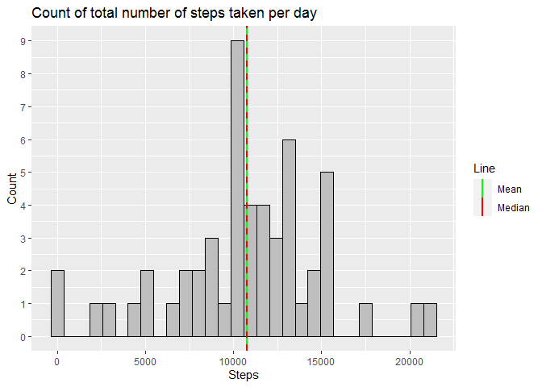
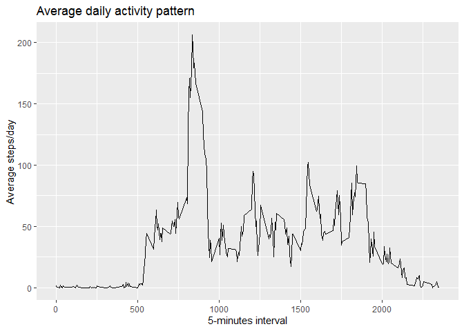
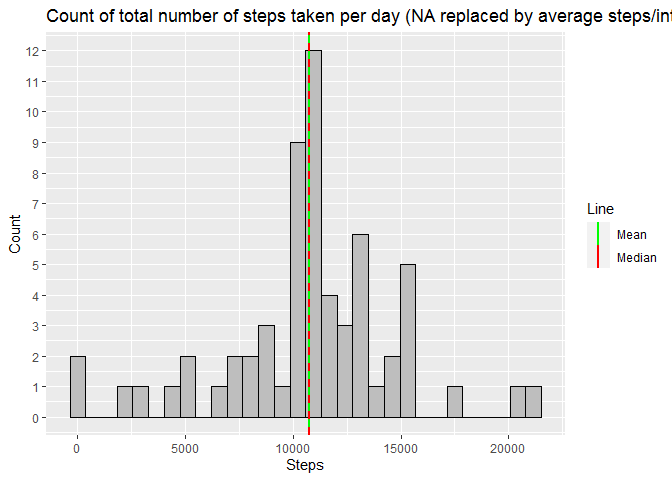

*Author: Paul Beuran (Github: PepperTiger)*

## Loading and preprocessing the data

Code to load and preprocess the data, and including the necessary libraries: 

```r
library(ggplot2)
act = read.csv("activity.csv")
act$date = as.Date(act$date, "%Y-%m-%d")
```


## What is mean total number of steps taken per day?

Code to plot the mean total number of steps taken per day:

```r
act_sum = aggregate(act$steps, list(act$date), sum)
act_sum = act_sum[complete.cases(act_sum),]
colnames(act_sum) = c("date", "steps")
p1 = ggplot(act_sum, aes(x=steps)) +
  geom_histogram(color="black", fill="grey", bins = 30) +
  scale_y_continuous(breaks = seq(0,10,1)) +
  geom_vline(aes(xintercept=mean(steps, na.rm = TRUE), color="mean"), linetype="solid", size=1) +
  geom_vline(aes(xintercept=median(steps, na.rm = TRUE), color="median"), linetype="dashed", size=1) +
  xlab("Steps") +
  ylab("Count") +
  labs(title="Count of total number of steps taken per day", colour="Line") +
  scale_color_manual(labels=c("Mean", "Median"), values=c("green","red"))
p1
```

<!-- -->


## What is the average daily activity pattern?

Code to plot the average daily activity pattern:

```r
act_mean = aggregate(act$steps, list(act$interval), mean, na.rm=TRUE)
colnames(act_mean) = c("interval", "steps")
p2 = ggplot(act_mean, aes(x=interval, y=steps)) +
  geom_line() +
  xlab("5-minutes interval") +
  ylab("Average steps/day") +
  labs(title="Average daily activity pattern")
p2
```

<!-- -->

The 5-minute interval containing the maximum number of steps on average across all days is :

```r
act_mean[act_mean$steps == max(act_mean$steps),]$interval
```

```
## [1] 835
```


## Imputing missing values

The number of missing values is :

```r
sum(is.na(act$steps))
```

```
## [1] 2304
```

Code to impute missing values, replacing them by average steps per intervals across all days:

```r
act_itm = aggregate(act$steps, list(act$interval), mean, na.rm=TRUE)
colnames(act_itm) = c("interval", "steps")
act_new = act
for(i in 1:nrow(act_new)) {
  if(is.na(act_new[i,"steps"]))
    act_new[i,"steps"] = act_itm[act_itm$interval == act_new[i,"interval"],]$steps
}

act_nsum = aggregate(act_new$steps, list(act_new$date), sum)
colnames(act_nsum) = c("date", "steps")
p3 = ggplot(act_nsum, aes(x=steps)) +
  geom_histogram(color="black", fill="grey", bins = 30) +
  scale_y_continuous(breaks = seq(0,12,1)) +
  geom_vline(aes(xintercept=mean(steps, na.rm = TRUE), color="mean"), linetype="solid", size=1) +
  geom_vline(aes(xintercept=median(steps, na.rm = TRUE), color="median"), linetype="dashed", size=1) +
  xlab("Steps") +
  ylab("Count") +
  labs(title="Count of total number of steps taken per day (NA replaced by average steps/interval)", colour="Line") +
  scale_color_manual(labels=c("Mean", "Median"), values=c("green","red"))
p3
```

<!-- -->

## Are there differences in activity patterns between weekdays and weekends?

Force OS to English weekday system:

```r
Sys.setlocale("LC_TIME", "C")
```

Code to plot the average daily activity pattern, depending of weekdays category:

```r
we = c("Saturday", "Sunday")
act_we = weekdays(act$date)
act_we = factor(ifelse(is.element(act_we, we), "WE", "N_WE"))
act_we = cbind(act, act_we)
colnames(act_we)[4] = "is.weekend"
act_we_mean = aggregate(act_we$steps, list(act_we$interval, act_we$is.weekend), mean, na.rm=TRUE)
colnames(act_we_mean) = c("interval", "is.weekend", "steps")
p4 = ggplot(act_we_mean, aes(x=interval, y=steps, color=is.weekend)) +
  geom_line() +
  xlab("5-minutes interval") +
  ylab("Average steps/day") +
  labs(title="Average daily activity pattern/weekdays category", color="Weekdays category") +
  scale_color_manual(labels=c("Non-weekend", "Weekend"), values=c("red", "blue"))
p4
```

<!-- -->
